# Data-Analytics-Project-2
# The final website
---
(Use the flask app to run the website. You need the API keys listed in the config.js file to retrieve the data.)
Current UV Index
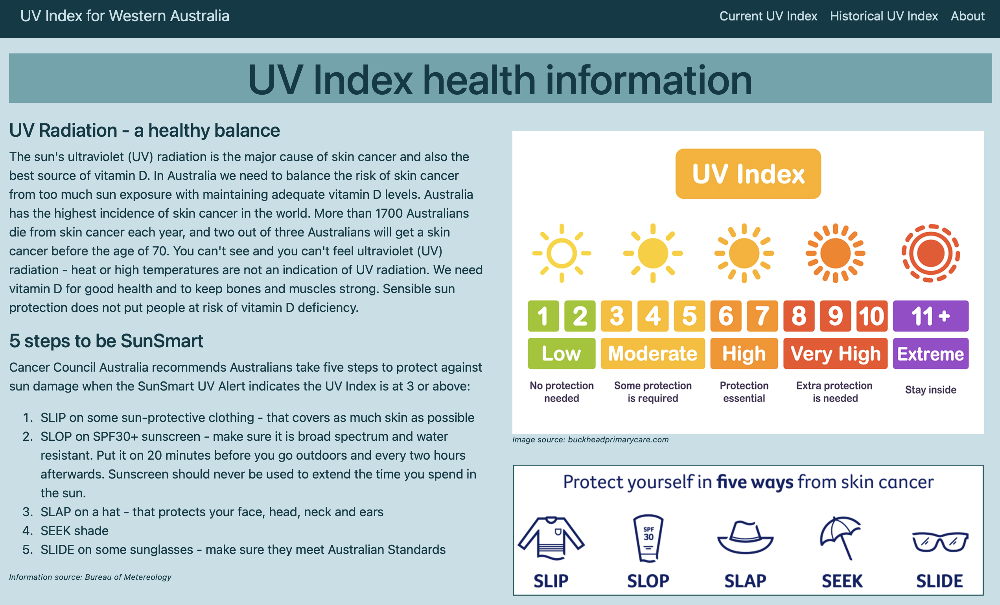
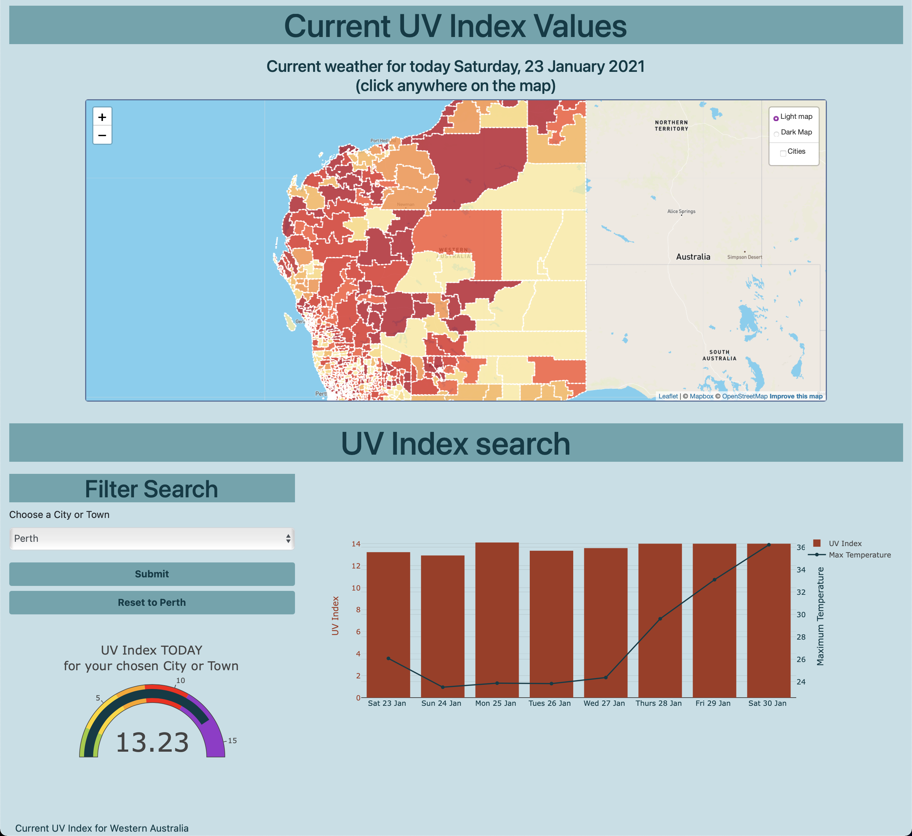
Historical UV Index
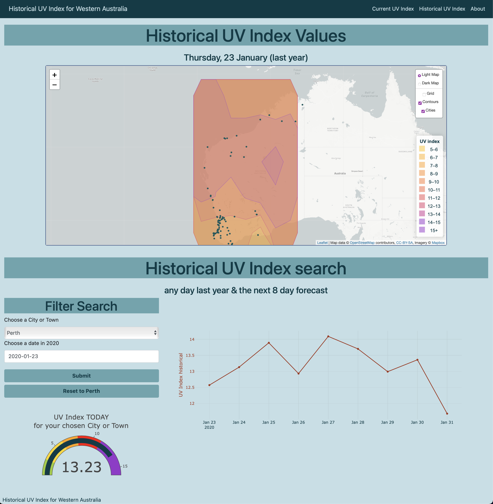
About our team
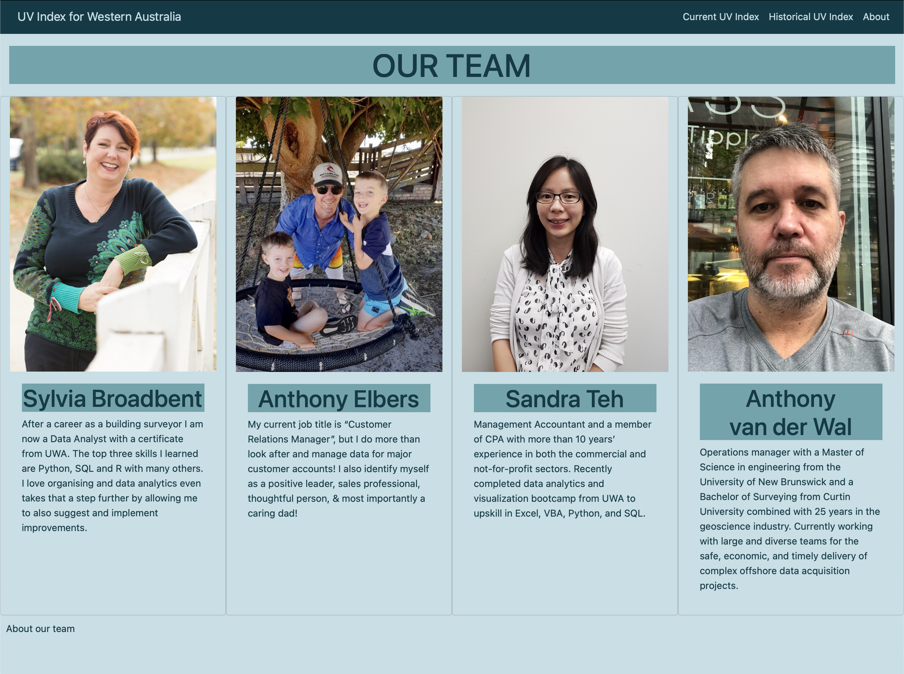

---
# Presentation

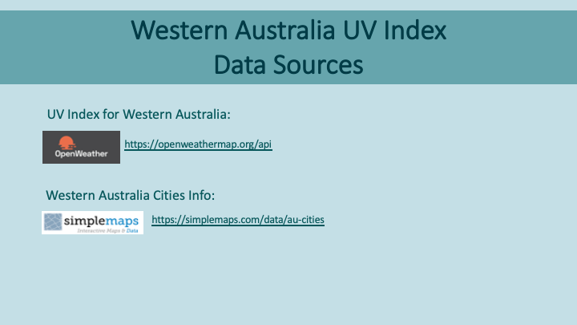

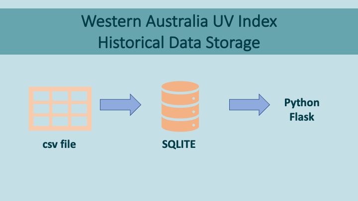
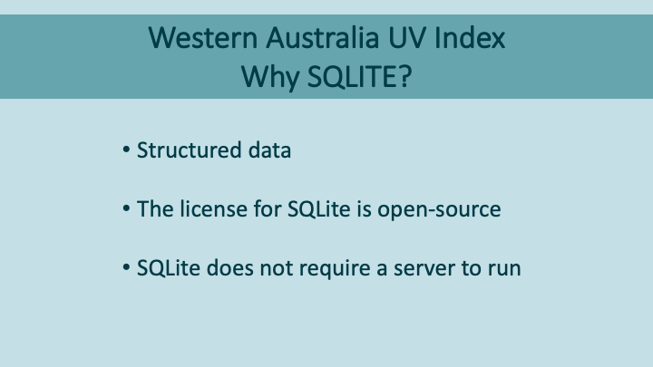
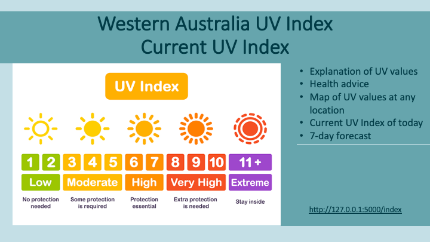
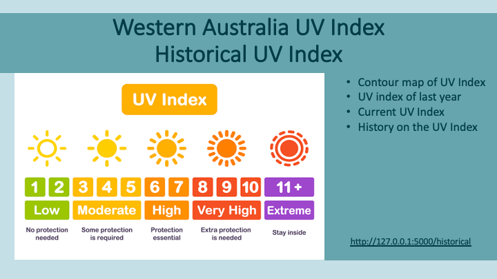

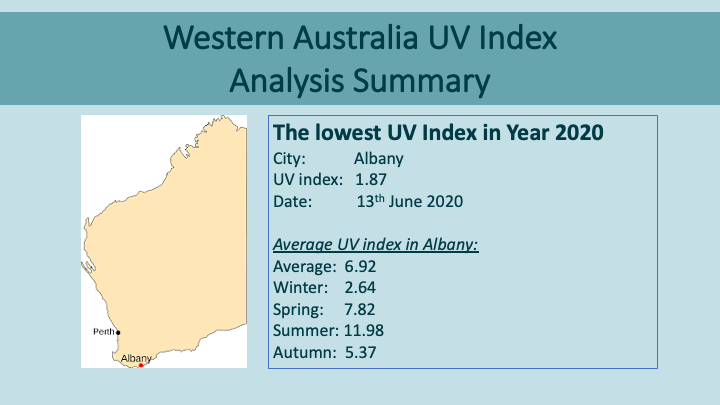

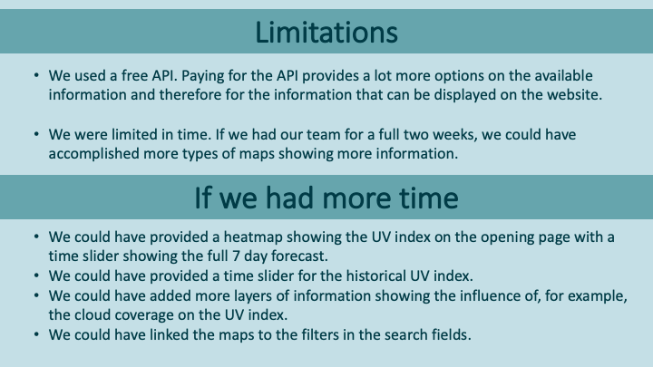
